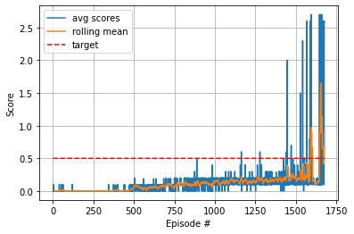

# Udacity-Deep-Reinforcement-Learning-p3-collaboration-and-competition - Tennis environemnt

## The solution
This tennis environment can be seen as an extension of the reacher environment where 20 agents were trained all together using DDPG. In this case we have to train 2 agents.
A good place to start is therefore the DDPG algorithm with 2 agents. 

### Initial experiments
First model
1. Two DDPG agents with the critics only getting their respective agents obervations.
2. Shared Replay buffer from which each critic sample experiences.
3. Actor Critic model with 2 hidden layers 400,300 dim each.
4. local and target models for both actor and critic with soft updates
5. Ornstein-Uhlenbeck noise with mu=0, theta=.15 and sigma=0.5

### final implementation

Using the PER along with the 2 DDPG agents i could solve the environment in 1677 episodes.

### The Actor Critic Models
1. Two Hidden layers with dimensions 400, 300 respectively and dropout layers with p=0.5
2. The Actors take in its own observations with input size of 24 and ouputs an action with size =2
3. The Critics take in their actor's observation and the actor's action making a total input of 24+2. The critics output a Qvalue with size =1

### Hyperparameters
1. buffer = 100000
2. batch_size = 96
3. tau = 0.02
4. lr_actor = 1e-4
5. lr_critic = 1e-4
6. w_decay = 0
7. gamma = 0.99

##Ideas for future work
1. Solve the environment in fewer episodes
2. Try the Prioritised Replay Buffer
3. Try the MADDPG implementation with critics receiving the full observations and actions
4. Observe the improvements with the categorical distribution - C51 algorithm

