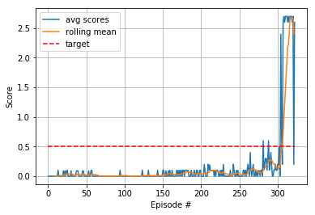

# Udacity-Deep-Reinforcement-Learning-p3-collaboration-and-competition - Tennis environemnt

## The solution
This tennis environment can be seen as an extension of the reacher environment where 20 agents were trained all together. In this case we have to train 2 agents.
A good place to start is therefore the DDPG algorithm with 2 agents. 

### Initial experiments
First model
1. Two DDPG agents with the critics only getting their respective agents obervations.
2. Shared Replay buffer from which each critic sample experiences.
3. Actor Critic model with 2 hidden layers 400,300 dim each.
4. local and target models for both actor and critic with soft updates

Second model
MADDPG algorithm
1. 2 DDPG agents with critics receving the full observation set
2. Shared replay buffer from which each critic sample experiences.
3. Actor Critic model with 2 hidden layers 400,300 dim each with drop out layers
4. Local and target models for both actor and critic with soft updates

Wit the both the above models, I couldn't train the model succesfully. The avg score over 100 consecutive episodes would increase to max 0.01 and then decrease. The cycle would just continue for greater number of episodes.

### final implementation
Intuitively, it felt that the agents needed to learn from the good actions (those rewarded positively) more frequently, and PER (prioritised replay buffer) is just perfect for that.

### Prioritised Replay buffer

I used the already implemented sumtree.py from rlcode.
And used this sumtree to update s,a,r,s tuples in the replay buffer.

Using the PER along with the 2 DDPG agents i could solve the environment in 1677 episodes.

### Delayed updates
The actor and critic networks learn every 10 timesteps and every learning step is repeated 5 times with 5 differnt samples.
Once the actor and critic networks being trained are updated, the target networks are updated with a soft update.

### The Actor Critic Models
2 Hidden layers with dimensions 400, 300 respectively and dropout layers with p=0.5

The Actors take in its own observations with input size of 24 and ouputs an action with size =2

The Critics take in their actor's observation and the actor's action making a total input of 24+2. The critics output a Qvalue with size =1

### Hyperparameters
1. buffer = 100000
2. batch_size = 128
3. tau = 0.02
4. lr_actor = 1e-4
5. lr_critic = 1e-4
6. w_decay = 0
7. update_every = 10 , 5 times
8. gamma = 0.99

